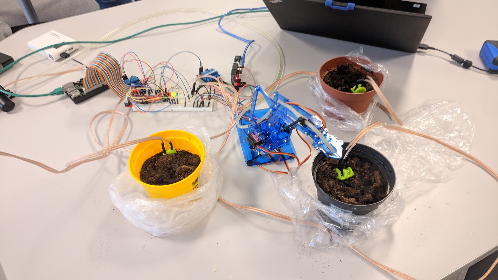

# Robotic Arm Watering Plants (RAWP)
This project was created as a school project where the goal was to use at least 1 servo and 1 acuator. This code was created with the arduino language and C as a learning experience so the code may have some not up to spec solutions in it, but i tried my best to make the code as optimal as possible while still keeping myself under the allowed time period i was granted when developing.

[Video of the program in action](https://youtu.be/SyNIbHF97vM)

---

# What you will need
A quick TL;DR of the items that you need to recreate this project is as follows:

* 1 Rasberry Pi (or another SoC with gpio capabilities)
* 1 Arduino
* 1 4DOF Robotic arm similar to [this](https://www.ebay.com/itm/Robot-Arm-Robot-4DOF-4-Axis-Rotating-Robotics-DIY-Automation-Joystick-Controller/112995117441)
* 1 ADC 0832CCN
* 3 2 wire copper cables with exposed parts at the end
* 4 Relays (3 for changing between copper cable sensors, 1 for talking to the arduino)

Optional but reccomended

* Breadboard
* Cables
* 4 LEDs to display wetness information

# Dependencies

Listed in sensor.c and `wiringPi` for GPIO pins in C. To compile the program:

> g++ sensor.c -o sensor -lwiringPi
